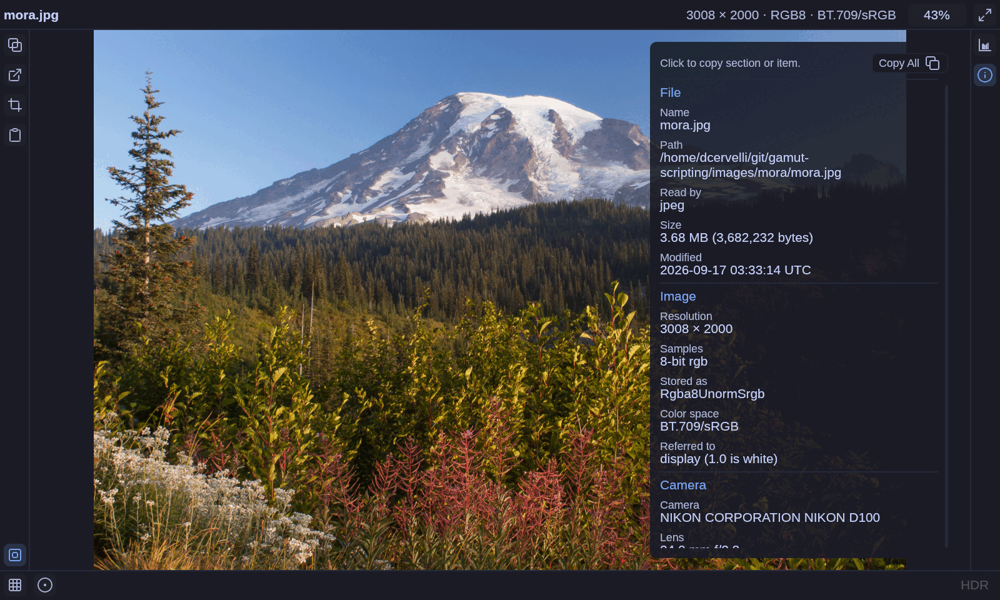
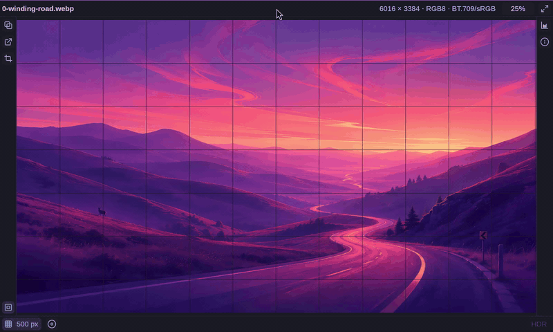
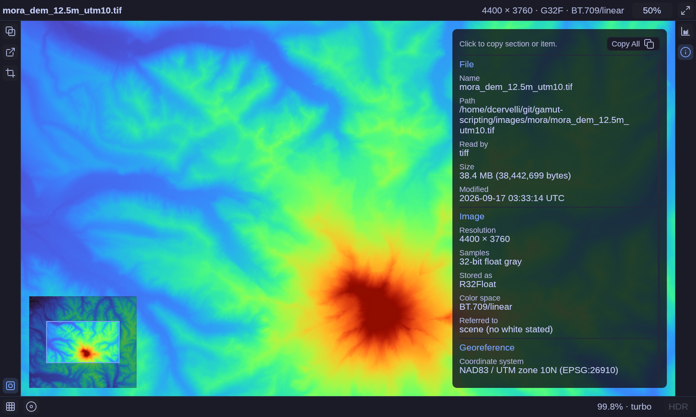

# gamut

A modern image viewer optimized for getting work done, fast.


## Features

### OS themed
Omarchy's Lupine and Tokyo Night themes:


### Copy image

### Paste image

### Pixel info

### Pixel grid
Scale dynamic pixel grid.


### Histogram and basic level manipulation

### Single channel false color

### HDR

### Color management

### File comparison

### File/directory watch

### Metadata/EXIF extraction
Get file, image, EXIF, georeference, and more metadata. Easily copy all, by section, or by item.


### Many formats
PNG, JPEG (with gain maps), TIFF and BigTIFF, WebP, HEIF (HEIC and
AVIF), GIF, ICO, BMP, netpbm, Radiance HDR and OpenEXR. 
More details in [`user-docs/FORMATS.md`](user-docs/FORMATS.md).

### Fast GPU display

### All features are keyboard accessible, discoverable in the UI, and settable via the CLI

### Desktop integration

## Install

```sh
cd packaging && makepkg -si
```

## Getting Started

Just pass filenames or directories to `gamut`:
```
gamut file1.jpg pictures file2.png
```
Directories are scanned non-recursively.

Enough keys to get going:

| Key | |
| --- | --- |
| `]`, `[` or `PgDn`, `PgUp` | Next / previous file |
| Space | Cycle fit → fit width → fit height |
| `1` | Actual size; wheel to zoom, drag to pan |
| `d`, `f` | Exposure down / up |
| `h`, `i`, `m` | Histogram, file information, minimap |
| `` ` `` | Hide the interface |
| `q` | Quit |

All controls are documented by the AI in [`user-docs/KEYS.md`](user-docs/KEYS.md). Every display control is also a
start-up flag, which `gamut --help` lists.

## Roadmap

This is very much pre-v1.0. 

## Contributing

Issues and pull requests are welcome.

[`docs/`](docs/) — AI generated and mainted notes on development.

## License

Dual-licensed under either of

- Apache License, Version 2.0 ([LICENSE-APACHE](LICENSE-APACHE))
- MIT license ([LICENSE-MIT](LICENSE-MIT))

at your option. 

[Lucide](https://lucide.dev) icon
geometries licensed under ISC.

Polynomial false-color ramps are CC0 or Apache-2.0.
Further information in [`docs/licensing.md`](docs/licensing.md).
