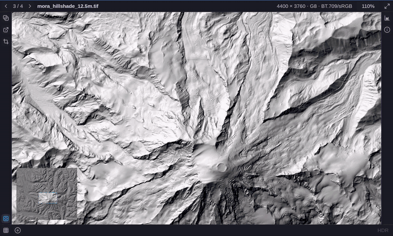
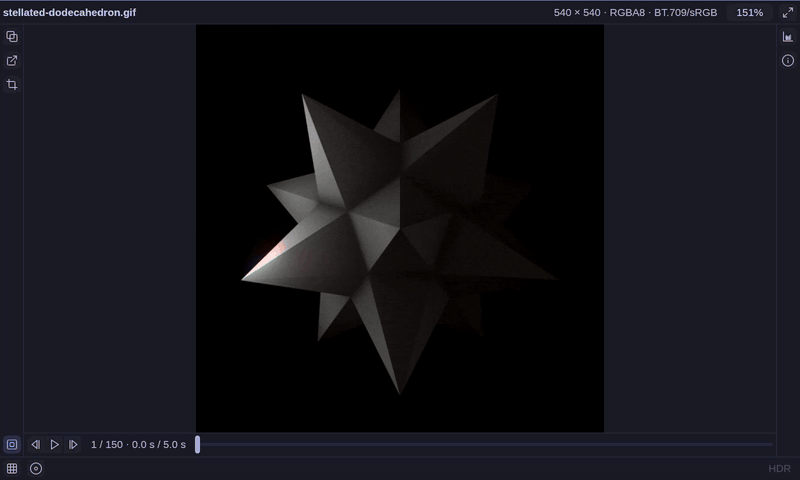

# gamut

A modern Linux image viewer optimized for getting work done, fast.


## Features

### Versatile Controls (Keyboard, UI, CLI)

All features can be keyboard driven but the hideable UI also contains discoverable controls with tooltips to learn the keyboard shortcuts. Controls can also be set via CLI flags.

### OS themed

Respects OS theme colors. Here's an example of Omarchy's Lupine and Tokyo Night themes.


*Omarchy note:* Use the following window rule:

```lua
o.window("com.dcervelli.gamut", { float = true, center = true, tag = "-default-opacity", opacity = "1 1" })
```

This will have the window open centered and floating with a reasonable and dynamic default size. For accurate image viewing, the window should be forced fully opaque.

### Copy image

Images can be copied in a variety of useful ways:

* As a filename, with or without the path.
* As a file URI, for copy/paste in a file explorer.
* As an image/png, for copy/paste as an image. Useful for Slack, etc. Copied images have the current settings applied.

### Paste image

Clipboard images can be pasted and saved to the standard pictures folder as `pasted_${date}.png`.

### Pixel info

Get coordinate and color information for the moused-over pixel. Easily copy either the coordinate or color (in a variety of formats).

### Pixel grid

Scale-dynamic pixel grid.


### Single channel false color

Grayscale, 16-bit and float single-channel images can be shown with various color maps.



### Histogram and basic level manipulation

Luminance and per-channel histogram, with a linear or log count axis. Exposure in quarter stops, a window that slides and narrows, automatic windows (0–1, min/max, 99.8%), and tone mapping (none, Reinhard, neutral) for highlights above white. Nothing re-decodes; the histogram panel holds the controls.

### HDR

Follows the monitor: an HDR surface where the compositor says the monitor is in HDR mode, SDR otherwise, and never asks the compositor to switch. PQ, HLG, OpenEXR, Radiance HDR and Ultra HDR gain-map JPEGs are shown at their graded brightness on an HDR surface and tone mapped on an SDR one. `o` toggles, `--output` forces.

### Fuzzy file navigation

`Ctrl+P` opens a chooser over the image. Type to filter the file list fuzzily (`dsc17` finds `DSC_0017.JPG`), across directories when the list spans more than one. Each row has a thumbnail, type, position in the list and size. Thumbnails are the freedesktop cache's own: ones the file manager made are reused, ones made here are written back.

### Animated/multi-image formats

Play animated GIF, PNG, WebP and JPEG XL files at normal speed or frame-by-frame. View multi-page TIFFs and ICOs.



### Color management

Untagged files are treated as sRGB. ICC profiles (sRGB, Display P3, BT.2020 and Adobe RGB primaries, power-law tone response) and CICP tags are honored; PQ and HLG are decoded. 16-bit, float and single-channel data stay as they are rather than being flattened to 8-bit RGB. `--transfer` and `--primaries` override what a file says or fails to say.

### File comparison

Every file is remembered as it was left: pan, zoom, window, exposure, tone map and false color. Flipping between two files with `[` and `]` therefore compares them rather than resetting them. A file opened for the first time inherits the current pan and zoom when it is the same size, so a directory of frames or exposures stays aligned under the same pixels.

### File/directory watch

The file on screen is re-read within about half a second of anything writing to it, keeping pan, zoom and display settings. A directory named on the command line is re-listed as images are added or removed, so a render dropping frames into a folder builds the list as you watch. A file deleted from under the viewer stays on screen, marked `DELETED`.

### Metadata/EXIF extraction

Get file, image, EXIF, georeference, and other metadata. Easily copy all, by section, or by item.


### Many formats

PNG, JPEG (with gain maps), JPEG XL, TIFF and BigTIFF, WebP, HEIF (HEIC and
AVIF), GIF, ICO, BMP, netpbm, Radiance HDR and OpenEXR. 
More details in [`user-docs/FORMATS.md`](user-docs/FORMATS.md).

### Fast GPU display

Decoding, uploading and thumbnailing run on their own threads; large TIFFs, HEICs and gain maps decode across every core. Exposure, window, tone map and false color are shader uniforms, so adjusting them never touches the pixels. Below 100% the image is drawn from a chain of exact area averages, so a frame costs the same however far out the view is. Images up to 4 GB decoded and 32768 pixels a side.

### Desktop integration

Registers as a handler for every format it reads, so it appears in file managers' "Open With" lists, and its own open button offers every other installed program that claims the file's type, read from the desktop's own MIME index. Ships a man page and bash, fish and zsh completions. Thumbnails are shared with the file manager through the freedesktop cache.

## Install

```sh
cd packaging && makepkg -si
```

## Getting Started

Just pass filenames or directories to `gamut`:
```
gamut file1.jpg pictures file2.png
```
Directories are scanned non-recursively.

Enough keys to get going:

| Key | |
| --- | --- |
| `]`, `[` or `PgDn`, `PgUp` | Next / previous file |
| Space | Cycle fit → fit width → fit height |
| `1` | Actual size; wheel to zoom, drag to pan |
| `d`, `f` | Exposure down / up |
| `h`, `i`, `m` | Histogram, file information, minimap |
| `` ` `` | Hide the interface |
| `q` | Quit |

All controls are documented by the AI in [`user-docs/KEYS.md`](user-docs/KEYS.md). Every display control is also a
start-up flag, which `gamut --help` lists.

## Roadmap

See [Roadmap](ROADMAP.md).

## Contributing

Issues and pull requests are welcome.

[`docs/`](docs/) — AI generated and maintained notes on development.

## License

Dual-licensed under either of

- Apache License, Version 2.0 ([LICENSE-APACHE](LICENSE-APACHE))
- MIT license ([LICENSE-MIT](LICENSE-MIT))

at your option. 

[Lucide](https://lucide.dev) icon
geometries licensed under ISC.

Polynomial false-color ramps are CC0 or Apache-2.0.
Further information in [`docs/licensing.md`](docs/licensing.md).
