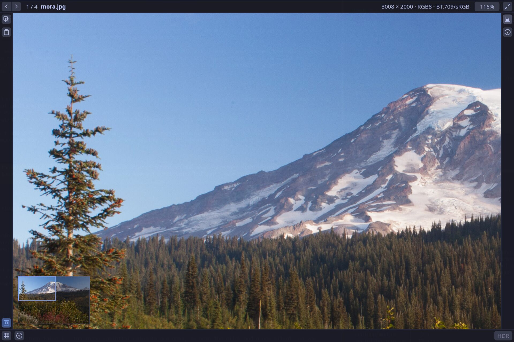

# gamut

A modern image viewer optimized for getting work done, fast.



## Features

### All features are keyboard accessible, discoverable in the UI, and settable via the CLI
### Desktop integration
### OS themed
### Copy image
### Paste image
### Pixel info
### Pixel grid
### Histogram and basic level manipulation
### Single channel false color
### HDR
### Color management
### File comparison
### File/directory watch
### Metadata/EXIF extraction
### Many formats
### Fast GPU display

## Install

```sh
cd packaging && makepkg -si
```

That installs the desktop entry, icon, and the binary.

## Getting Started

## Docs

## Roadmap

## Contributing

Issues and pull requests are welcome.

## License

Dual-licensed under either of

- Apache License, Version 2.0 ([LICENSE-APACHE](LICENSE-APACHE))
- MIT license ([LICENSE-MIT](LICENSE-MIT))

at your option. 

[Lucide](https://lucide.dev) icon
geometries licensed under ISC.

Polynomial false-color ramps are CC0 or Apache-2.0.
Further information in [`docs/licensing.md`](docs/licensing.md).

# OLD

A GPU image viewer with real color management — for photographs, measurement
data and HDR frames.

Most viewers flatten what they open to 8-bit sRGB on the way in. `gamut` does
not. A 16-bit scan, a floating-point elevation model and an HDR frame all go
through one linear pipeline and keep the numbers they arrived with, so you can
put the pointer on a pixel and read what the file actually stores there —
alongside what the screen is doing with it.

It is written in Rust, on `winit`, `wgpu` and `glyphon`.

## What it is good at

- **Reading the data, not a picture of it.** 8-, 16- and 32-bit, integer and
  float, one to four channels. Exposure, an adjustable display window,
  tone mapping and false color, all live on the GPU.
- **Comparing.** Every file remembers how you left it, and stepping between
  images of the same size keeps the pan and zoom — so flipping between two
  frames actually compares them.
- **Watching.** The file on screen and the directory it came from are both
  watched, so a render finishing or a script dropping a frame shows up within
  about half a second, with your view untouched.
- **HDR.** On a monitor in HDR mode it uses the headroom rather than clipping
  to white, and it says so when it is throwing highlights away.
- **Saying what a file is.** EXIF for photographs, GeoTIFF for rasters, in a
  panel where every field can be copied.

Formats: PNG, JPEG (with gain maps), TIFF and BigTIFF, WebP, HEIF (HEIC and
AVIF), GIF, ICO, BMP, netpbm, Radiance HDR and OpenEXR. The details, and the
places each one will surprise you, are in
[`user-docs/FORMATS.md`](user-docs/FORMATS.md).

## Install

There is no published package yet. Build it from source as below; the pieces
an Arch package is made of are in `packaging/`, and `makepkg` will build one
from a tagged release:

```sh
cd packaging && makepkg -si
```

That installs the desktop entry and the icon as well as the binary, so a file
manager offers `gamut` for a picture and `xdg-open` reaches it.

There are no prebuilt binaries, and none are planned: the package is compiled
from the source of a tagged release.

Everything is pure Rust except HEIF, which links the system `libheif` (1.23 or
newer) — `libheif` on Arch, `libheif-dev` on Debian, `brew install libheif` on
macOS. Which HEIF *codecs* work then depends on that installation's plugins:
HEVC (`.heic`) needs libde265 or ffmpeg, AV1 (`.avif`) needs dav1d or aom.
Both ship as standard on the distributions above.

## Running it

```sh
cargo run --release -- photo.jpg scan.tiff render.exr
```

A directory named instead of a file stands for the images directly inside it,
in name order — and it stays a place to look rather than a list fixed at
startup, so files written into it later join the walk.

Enough keys to get going:

| Key | |
| --- | --- |
| `]`, `[` | Next / previous file |
| Space | Cycle fit → fit width → fit height |
| `1` | Actual size; wheel to zoom, drag to pan |
| `d`, `f` | Exposure down / up |
| `h`, `i`, `m` | Histogram, file information, minimap |
| `` ` `` | Hide the interface |
| `q` | Quit |

The rest — every key, every button, and what the mouse does — is in
[`user-docs/KEYS.md`](user-docs/KEYS.md). Every display control is also a
start-up flag, which `--help` lists.

## Status

Pre-1.0, and not yet tagged. It is used daily on Linux under Wayland, which is
where it is developed; the HDR surface selection and the desktop theming are
Wayland-specific, and everything else is portable but far less exercised.

The things most likely to matter to you:

- Decoding is synchronous — a very large raster blocks the window for a few
  seconds, and an image has to fit in one GPU texture.
- EXIF orientation is not applied, so a rotated phone JPEG shows unrotated
  (HEIF and WebP excepted).
- Animated GIF and WebP show their first frame only, and an ICO shows its
  largest entry only.
- HEIF gain maps are not read, so an Apple HDR photograph shows its SDR base.

The full list, with the reasons, is in [`docs/limits.md`](docs/limits.md).

## Documentation

- [`user-docs/`](user-docs/) — for using it: [keys and
  mouse](user-docs/KEYS.md), [image formats](user-docs/FORMATS.md).
- [`docs/`](docs/) — for working on it: architecture, color management,
  resampling, the interface, the decoders, the tests.
- `CLAUDE.md` — the map for making changes.

## Contributing

Issues and pull requests are welcome. `cargo test`, `cargo clippy
--all-targets` and `reuse lint` all need to be clean; `AGENTS.md` describes
the layout and the conventions a change is expected to follow.
